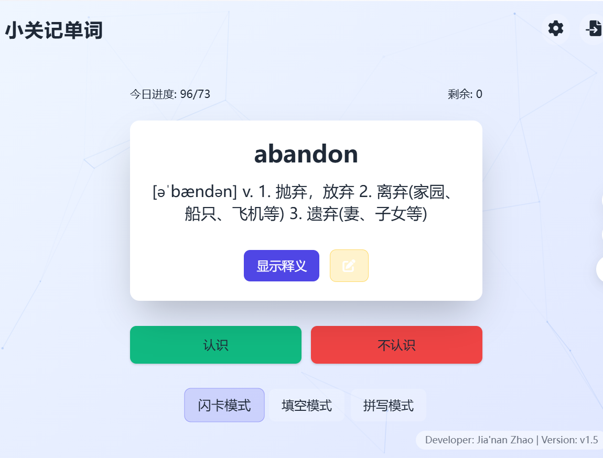
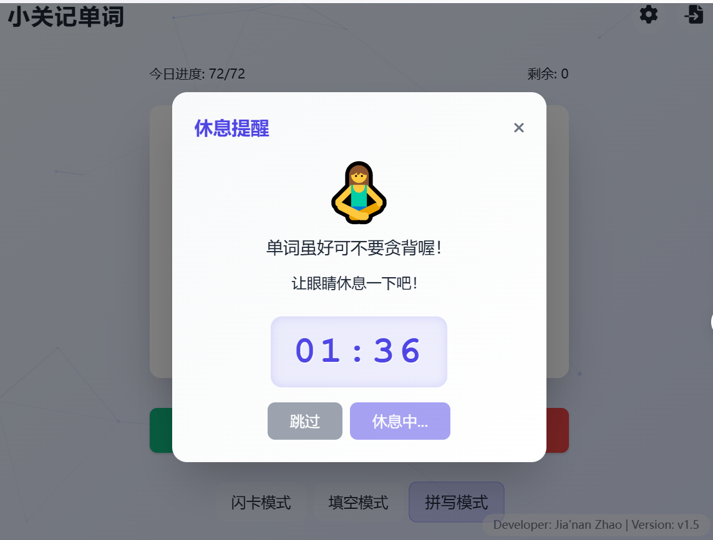

# 🧠 小关记单词 · Recite-Words

一个轻量级但功能强大的记单词神器，支持自定义词库、三种记忆模式、任务计划与休息提醒  
基于 Flask + Socket.IO 构建，适合所有英语学习者 🎯

---

## 📸 项目预览

### 软件主页面



### 休息提醒


---

## 🚀 功能特色

- 📂 **支持导入词库**：支持 `.txt` 或 `.csv` 格式，轻松自定义你的专属单词表
- 🎮 **三种记忆模式**：
  - 🌩️ 闪过模式（快速浏览）
  - 🧩 填空模式（测试理解）
  - ✍️ 拼写模式（锻炼输入记忆）
- 📅 **任务计划功能**：可设置每日学习任务量（例如每天记忆 20 个单词）
- ⏰ **提醒功能**：支持自定义设置每日提醒时间
- 🧠 **自动记忆状态**：保存学习进度、记忆情况与最高得分
- 🧑‍💻 **前后端分离**：基于 Flask 后端 + 静态前端，支持本地部署或服务化部署

---

## 🗂️ 项目结构

```

custom_vocabulary_master
├── backend/                 # Flask + SocketIO 后端服务
│   ├── app.py              # 主服务入口
│   └── requirements.txt    # 后端依赖
├── frontend/                # 静态前端页面
│   ├── index.html
│   ├── css/
│   ├── js/
├── screenshots/             # 项目截图（可选）
├── vocabulary/              # 用户导入的词库文件夹（支持 txt/csv）
│   ├── CET6_edited.txt    #六级单词库  
├── app.log/             # 项目日志


````

---

## ⚙️ 环境依赖

- Python 3.7+
- pip

后端依赖：
```bash
pip install -r backend/requirements.txt
````

或手动安装：

```bash
pip install flask flask-socketio flask-cors eventlet
```

---

## 🔧 如何使用

### 1. 克隆项目

```bash
git clone https://github.com/你的用户名/custom_vocabulary_master.git
cd custom_vocabulary_master
```

### 2. 启动后端服务

```bash
cd backend
python app.py
```

默认运行在 `http://localhost:5000`。

### 3. 打开前端页面

使用浏览器打开：

```
frontend/index.html
```

---

## 📤 如何导入自定义词库

支持 `.txt` 或 `.csv` 文件放置在 `vocabulary/` 目录下，格式如下：

### ✅ txt 文件格式

```
apple 苹果
banana 香蕉
computer 电脑
```

### ✅ csv 文件格式

```csv
word,meaning
apple,苹果
banana,香蕉
computer,电脑
```

---

## 🧠 模式说明

| 模式 | 描述            |
| -- | ------------- |
| 闪过 | 类似卡片记忆，快速认识单词 |
| 填空 | 在句子中填写空缺，加深理解 |
| 拼写 | 根据提示或发音拼写单词   |

---

## 📅 任务计划 & 提醒功能

* 在前端设置页面中自定义「每日任务量」
* 设置提醒时间，系统将在对应时间提醒你学习（浏览器提示或手机提醒）

---

## 📦 打包成 EXE（可选）

你可以使用 PyInstaller 将项目打包为 Windows 可执行文件：

```bash
pyinstaller --noconsole --add-data "../frontend;frontend" app.py
```

生成的 exe 文件位于：

```
backend/dist/app/app.exe
```

运行后端服务后使用浏览器访问：

```
http://localhost:5000
```

---

---

## ✨ 开发者（Developer: Jia'nan Zhao | Version: v1.5）

这个项目是我为自己背单词开发的轻量工具，希望也能帮到你们。
有建议或想法欢迎提 Issue 或 PR 🙌

---


```


